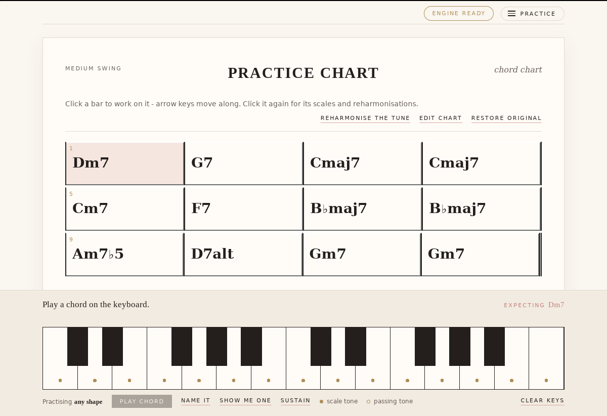
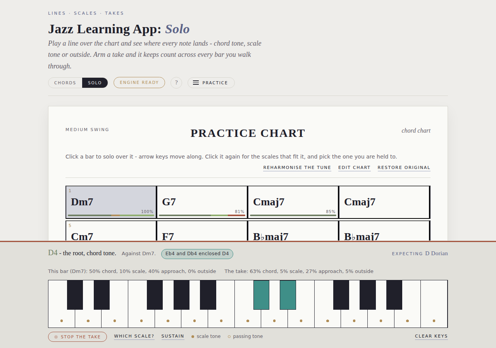
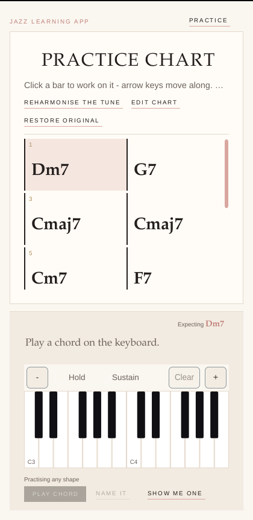

# Jazz Learning App — POC

A cross-platform jazz education app built on JUCE. Build and reharmonise chord
progressions, see which scales fit each chord, and get feedback on the voicings you play.

This repository is the proof of concept for the two core modules in
[`docs/jazz_learning_app_design.pdf`](docs/jazz_learning_app_design.pdf): the
**Reharmonisation Assistant** and the **Real-Time Chord/Voicing Analyzer**, sharing one
responsive UI and one UI-agnostic theory engine.




## Layout

| Directory | Layer | Depends on |
|---|---|---|
| `modules/core_engine` | Chord parsing, scale suggestion, reharmonisation, voicing analysis, solo-line reading, note-input abstraction. Pure C++17. | nothing |
| `modules/engine_api` | The engine's answers as JSON - one wire format, read by both shells. Pure C++17. | core engine |
| `web` | **The user interface.** One page, served on the web and hosted by the app, plus the WebAssembly build, the offline worker and the smoke test that drives the built page. | engine API (as JSON) |
| `app` | Platform shell: a webview showing `web/`, plus MIDI devices, the audio device and its electric piano, and file reading. | engine API, JUCE |
| `assets` | What both shells need as files: the band's recorded instruments, and pdf.js. The app compiles these into its binary; `web/build.sh` copies them next to the page. | nothing |
| `tests` | Engine unit tests (534), no JUCE, no third-party framework. | core engine, engine API |

The core engine links no JUCE at all — that boundary is what keeps a future AUv3/VST3
target possible without a rewrite, and the build enforces it (see below).

**There is one user interface, and it is the web page.** The desktop app shows that same
page in a webview and keeps for itself only what a page cannot do: opening MIDI devices,
owning an audio device, reading a file off a disk. The engine it talks to is the native
C++ already in the process - the app needs no Emscripten to build, and the WebAssembly
build exists only for the browser. Before this, the two shells were separate
implementations of the same screen, and keeping them in step cost more than it bought.

## Building

Requires CMake 3.22+ and a C++17 compiler. JUCE is resolved by
`cmake/GetJUCE.cmake`, in this order: `-DJUCE_PATH=/path/to/JUCE`, a `JUCE/` checkout
beside this repo, or `FetchContent` from GitHub (JUCE 8.0.4).

```bash
# Everything: engine, UI, standalone app, tests
cmake -S . -B build -DJUCE_PATH=/path/to/JUCE
cmake --build build

# Engine + tests only - no JUCE, no GUI libraries needed
cmake -S . -B build-core -DJAZZ_BUILD_APP=OFF
cmake --build build-core
./build-core/tests/jazz_core_tests     # or: ctest --test-dir build-core

# Adding a test changes a number quoted in this file and in the page's
# colophon. The suite is the only thing that knows it, so nobody counts:
./tools/test-count.sh                  # writes it in; --check is what CI runs
```

Both configurations run in CI on every push (`.github/workflows/ci.yml`): the engine job
deliberately runs on a machine with no JUCE and no GUI packages, so if it fails the module
boundary has been crossed rather than the runner being short a dependency.

On Linux the app additionally needs WebKitGTK for its webview
(`libgtk-3-dev`, `libwebkit2gtk-4.1-dev`; 4.0 also works). macOS and Windows need nothing
extra - WKWebView is part of the system and WebView2 comes in through JUCE.

On Linux the app target also needs the usual JUCE packages (`libasound2-dev`, `libx11-dev`,
`libxcomposite-dev`, `libxcursor-dev`, `libxext-dev`, `libxinerama-dev`, `libxrandr-dev`,
`libxrender-dev`, `libfreetype6-dev`, `libfontconfig1-dev`, `libglu1-mesa-dev`,
`mesa-common-dev`). macOS and Windows need no extra packages.

**iOS**: configure with the JUCE iOS toolchain (`-DCMAKE_SYSTEM_NAME=iOS -GXcode`) and
open the generated project. **Android**: JUCE's CMake support does not cover Android, so
that target needs the Projucer/Gradle exporter over the same sources — expect this to be
where MIDI bugs show up first (see the platform notes in `CLAUDE.md`).

## Trying it

The app opens on a built-in practice chart, drawn as a lead sheet: systems of four bars
divided by barlines, with the feel, the title and the composer written along the top bar
the way a lead sheet engraves them. Click a bar to move to it; click the bar you are
already on for the question the mode you are in is about.

The page is **three zones, not a scrolling document**: the top bar at its own height, the
chart taking everything left over and scrolling *itself*, and the dock at the bottom. That
is not decoration. Laid out as a document, the chart got whatever the other two had
finished with - four bars of twelve readable in a 1280x860 window, and **none at all** at
430x860, where the first bar started below the dock. The head is in the top bar for the
same reason it is worth having: in the sheet it scrolled away with the music, so the one
thing naming what you are playing left the screen as soon as you played past the first
line.

Under it is the **transport strip**: Static or In time, the metre and the tempo, the take
button and the dots saying where in the bar the clock is. All of it used to be three levels
down the Practice menu, which is a strange place to keep the things you reach for with one
hand on the keys. The strip is the same height whatever is showing - most of what is on it
needs a clock, and if the row grew when the clock came on it would shove the music down
under the eye reading it.

Everything that is a setting rather than a gesture is behind a button, and **the button
sits beside the thing it changes**. There are five, and each one is a question:

| | where | what it asks |
|---|---|---|
| **Practice** | top right | the machine: which sound bank, a MIDI keyboard, what is running |
| **Take setup** | transport strip | this take: count in, loop, speed up each chorus, reharmonise as you play |
| **Chart** | left of the chart's row | which tune: import and export, reharmonise, edit, restore, and your saved tunes |
| **Voicings** / **Scales** | right of the chart's row | what you are being read against: the shape in chord practice, the vocabulary in solo |
| **The band** | beside it | who is playing with you: piano, bass, drums, their style and their sound |

There used to be two panels in opposite corners and nothing said which held what: the
band's piano sound was in one and your own was in the other, both of them called *Sound*.
Putting all of it behind **Practice** fixed that and bought a different problem - a panel
of six sections is a filing cabinet, and three of those sections were things you change
while **looking at the music** rather than while looking at a menu. So the band and the
reading moved to buttons of their own in the chart's own row, right-aligned beside *Chart*.
What is left under *Practice* is the machine, which is what you open a settings panel for.

That row is free, which is why they went there rather than up beside *Practice*: it is
there either way and the same height whatever is in it, so a button hung from it takes no
music away - measured at 390, 900, 1024 and 1440, with the top of the sheet unmoved at
every one. The top bar cannot say that of even one labelled button: three letters there
cost 38px of chart at 1024px, which is a laptop rather than an edge case. What the row does
cost is that its buttons scroll away with a long tune - right for what you set up before
you play, wrong for anything you reach for mid-take, which is why the transport keeps its
own.

**Voicings** and **Scales** share one button, because they are never both on offer: one is
chord practice's question and the other is solo practice's, so the label follows the mode.
A button that changed what it opened would be a trap; a button that changes its name is
just the label for what is behind it.

Below 760px the **Practice** panel becomes a bottom sheet with a close row of its own,
because at that width it is drawn over the button that would otherwise dismiss it.

Emptying the sheet of everything that was not music is most of what the chart gained:

| | music starts | bars in view at 390x780 |
|---|---|---|
| before | 124px into the chart zone | 4/12 |
| after | 71px | 8/12 |

At 430x860 the chart stopped needing to scroll at all - 572px of content in a 382px zone
became 382px in 382px.

**And the chart fills the room it is given** rather than banking the difference at the
bottom. A twelve-bar tune is 404px of music in a 560px zone on a large window; left
top-anchored that is 156px of empty paper under the last barline, which reads as the page
having run out. The gaps between systems grow first, up to a limit, because space spread
through the chart is felt as air and the same space at the end is felt as a void; whatever
is left over goes evenly above and below, which is what centres a tune too short to have
gaps at all. On a tune longer than the window nothing happens - there is nothing to give
away, and it scrolls as before.

**How the room was set up is remembered; what you were doing is not.** Come back and the
tempo, the metre, Static or In time, your sound, who is in the band and what they are
playing, the guide tones and the loop are as you left them. The chart is not, and neither
is a take: reloading is meant to find the stand where you left it, not to resume a
session - a page that opened mid-take would be counting you in for something you had not
asked to play. Nothing here needs an account or a server; it is your own browser's
storage, and a browser that refuses it simply forgets between visits.

The desktop app and the browser page are not merely alike: they are the same page. A
screenshot of one is a screenshot of the other, because there is one file. What differs is
what is behind it - native C++ in the app, WebAssembly in the browser - and which of the
two is answering is written in the colophon, under *About* in the settings panel.

**Chords** and **Solo**, at the top, are the two things you can practise against that one
chart. Chord practice asks whether the voicing you played says what the bar says. Solo
practice asks a different question of the same notes: where does each one sit. It is a
mode, not a second screen - the chart, the keyboard, your MIDI connection and the sound
all stay exactly where they were, and the bar you are on is the same bar in both.

### Chord practice

Play a chord on a MIDI keyboard or the on-screen keyboard and the dock says what it makes
of it: whether it is the chord the bar asks for, what is missing, what is outside, what is
clashing or muddy, and what would improve it. **Expecting Dm7** at the right of the dock
says which bar it is being checked against.

**Voicings**, in the chart's row, sets a shape for the whole session - root position,
shell, rootless left hand, two-handed rootless, solo - and every voicing you play is then
checked against it, so a rootless voicing played during a root-position exercise is
reported even though the notes spell the chord. **Show me one** offers the base shape, and
pressing the button again walks on to the next one rather than repeating the last. What it
shows goes under your hands rather than merely onto the screen, so it sounds, is analysed,
and can be named - the same path a played chord takes.

**Name it** asks the other question - not "is this the right chord for the bar" but "what
did I just play", with no chart involved. **Edit chart** types chords into bars directly,
**Reharmonise the tune** applies a plan to the whole chart at once, and when a voicing you
play turns out to spell a substitution rather than the written chord, **Write it into the
bar** keeps it.

Clicking the bar you are already on opens **its substitutions**, grouped from the closest
to the original harmony outwards, each with a difficulty tag and a rationale. Choosing one
rewrites the bar.

### Seeing the voice leading

**Guide tones**, beside the keyboard, marks the thing a chord chart cannot show you. A
progression is two lines moving a semitone at a time with the roots underneath - the 3rd
and the 7th of each chord, each resolving into the nearest guide tone of the next - and
that is what carries the harmony. The symbols say where the chords are; they say nothing
about how they join up.

Switch it on and play something. The two keys the **next** chord's guide tones are on light
up with their degree on them, and the legend names the chord they are for. Over
`| Dm7 | G7 | Cmaj7 |` you play a Dm7 and the answer is in front of you: the F under your
hand keeps its badge - it is G7's 7th too, it does not move - and the C you are holding
lights the B a semitone below it. That is the ii-V, on the keys you play it on.

They are **voiced**, not named. The same G7 asked of a left hand at the bottom of the
keyboard and of two hands in the middle of it gives marks an octave apart, and both are
right - which half of the answer a chart cannot give you is the octave, and a hint that
made you work it out would be doing none of the work. The engine is handed the notes you
actually played, so it is leading from your voicing rather than from an idealised one:
each guide tone goes in the octave nearest the note it leads from, and the notes are
paired to the tones so the hand as a whole moves least. With fewer notes down than there
are guide tones - a single note in solo practice - one note leads into both.

A guide tone already **under a finger** keeps its badge, inverted. That is the most useful
thing the hint can say about it: this one does not move.

It follows the chart as well as the hand. In time, the downbeat arriving asks about the
next chord for the hand that has not moved; and it follows the tune wherever it goes -
including when *Reharmonise as you play* moves the chart under you, which is the one place
you can watch voice leading change as it happens.

What it points at is the next bar that says something **different**, not simply the next
bar. Two bars of the same chord would otherwise read "stay where you are" for as long as
the chord lasts and then say nothing at all on the bar where it changes - the one bar it
was wanted.

It is in **both modes**. Guide tones are target notes to a soloist and a voicing to a
comper, which is the same two notes asked about twice, so it is the same hint rather than
a second one.

### Solo practice




The keys do not latch here, because a line is played rather than held: each note sounds,
is read back - **E4 - the 9th, scale tone, in D Dorian** - and lets go. Every note is read
on its own, so a rolled double-stop is two notes each read where it sits rather than one
chord. Where chord practice writes *Expecting Dm7*, this mode writes **Expecting D Dorian** -
the scale you are actually being held to.

**A note outside the harmony is not called a mistake when you play it.** It is **open**:
you have started something, and at that instant nothing can know how it ends. A chromatic
approach, an enclosure and a passing tone are all outside by pitch and all three are the
line working; what tells them apart from a note that simply did not land is *where the line
goes next*. So the app does not guess. What it says instead is the thing that is true right
then - *a semitone up lands on D4, the root* - which is both more use than a verdict and
correct whichever way the line goes.

Then the next note usually decides it. Step home, or take the target from both sides first,
and the note is read again as an **approach note** that counts as landing. Play something
that lands somewhere else instead and it settles as **outside** right there. Only one thing
buys another note: a second outside note with room between the two for a target, because
that is an enclosure still in play and closing the first one would be calling a miss on a
phrase about to land. It can all happen across a barline, because running chromatically into
the next chord is one of the most idiomatic things in the idiom, and it works whether or not
a take is armed - a player trying things out is the one most likely to be experimenting with
chromatic notes, and is told at exactly the same moment an armed one would be.

The answer is about a note you have already played past, so it arrives somewhere you are
still looking. A chip in the dock holds the open note and changes colour with it - *Db4
wants D4* in grey while it is open, *Db4 landed on D4* in green, *Db4 never landed* in the
outside colour. And the key you played it on **stays lit** rather than fading like every
other note, until the line says what it was; then it relights in that colour for a moment
and goes out. Nothing else on the keyboard moves while a note is open, which is what makes
it catchable out of the corner of an eye.

One note can do both at once - play Eb, then F#, then G, and the G is the chromatic approach
the F# earned while the Eb is left having enclosed nothing - so the chip names both and each
key takes its own colour.

**An enclosure gets a colour of its own**, teal rather than the approach green. It is an
approach note by every measure the engine takes - it lands, it counts as colour, the score
has no opinion about it - but taking a note from both sides before you play it is deliberate
in a way a passing tone is not, and a reading that called the two the same thing would lose
the harder thing you did. The bar strip still counts it as an approach note, because that is
where four tiers are being counted rather than one note's story being told.

**Nothing is graded on a note while it is still open.** That is the practical half of it.
The score reads only the notes whose reading is final, so it no longer dips the moment you
reach for a chromatic approach and climb back two notes later when you land it - which read
as the app marking you down for a phrase it was about to approve of.

**Start a take** to be counted. While a take runs the dock carries a red line and the button
a pulsing dot, because a take counting on quietly is the one thing here that would be
annoying to find out about late. It reports the bar you are on and the take as a whole, and
walking to another bar does not end it - the target moves and the notes keep accumulating,
which is most of what soloing over a chart is. **Stop the take** freezes a summary: how the
whole thing divided up, and which bar pulled away from the rest. A note outside the scale is
*outside the scale*, never wrong.

In time, **the chart follows the bar you are on**. On a tune longer than fits, the rolling
mark used to march off the bottom and stay there - at the one moment a player cannot reach
for a scrollbar. It scrolls by the system rather than the bar, because a line of music is
the unit you read, and only when the bar has actually left: a chart that already fits never
moves under you.

Every bar you play over also carries its own verdict, **on the bar**: a slim four-part strip
in the same colours the dock uses - chord tone, scale tone, approach note, outside - in
proportion, and a **percentage** for how the bar went. It fills in as you play and stays
after you stop, so the bar that got away is one you can see at a glance down the chart rather
than one you have to read about underneath it. The exact counts are on the bar's tooltip, and
in its name for a screen reader.

**Clicking a bar you have played over asks it for the whole reading.** The strip is a
glance; the bar's own dialog gains a **This bar's take** tab beside the scales, and that is
the same reading with its working shown - how many notes landed in each tier, what share of
the bar each was, and the one line about what the score does and does not count. A bar the
take never reached has nothing extra to say and does not offer the tab.

The percentage is the one number in this app that is a judgement rather than a count, so it
is worth saying what it judges. It reads the notes whose reading is final, and nothing else.
Of those: chord tones, scale tones and approach notes all count as landing - the difference
between them is colour, not correctness. What is left as *outside* counts a quarter rather
than nothing, because a note that resolved into nothing may still have been the best note in
the line. What is left is balance, worth fifteen points at the very most: a line is chord
tones anchoring it and everything else colouring it, so a bar that never leaves the chord and
a bar that never touches it are both one-sided and are marked the same - and a bar of one or
two notes is not unbalanced, it is short. It is a reading of a bar, not a mark for a player;
nothing anywhere in here calls a note wrong.

Stopping the take also reads the line as a **line**, separately from where its notes sat.
Which bars went by without the line ever leaving the chord - *add some colour*, said about
the bar rather than about any note. Whether big leaps were followed by a step, which is what
fills the gap a leap opens. And whether the whole take stayed inside about a hand's width,
when the horn players it is all stolen from use the range. None of the three touches the
score: they are advice about how a line moves, the score is a reading of where its notes sat,
and mixing the two would make a number nobody could explain out of one that can be.

**Scales** - the same button, in solo practice - is the vocabulary you are working out of:
the modes, melodic minor, harmonic minor, bebop, pentatonics and blues, whole tone and
diminished, or everything. It decides which scales a bar is offered and which one it is read against, so
practising the modes over a tune and practising bebop over the same tune are two different
exercises. A style with nothing for a bar - bebop over a diminished chord - shows the whole
catalogue instead and says so, rather than calling every note you play outside.

Clicking the bar you are already on opens **its scales**, narrowed to that style; choosing
one is not just something to look at, it is what the bar is read against from there on, and
it survives the bar being opened again. Between the style and that choice is where the
forgiveness in solo mode lives, and it is deliberate: reading against *every* scale that fits
a chord sounds more generous and in fact leaves nothing outside anything - over Cmaj7, G7 or
Bbmaj7 not one of the twelve notes comes back outside. **Which scale?** says which one you
are being held to, and puts it on the keyboard.

**Static** or **In time** is the switch at the left of the **transport strip**, the row
under the chart's head. Static is the default: the bar you are on is the bar you chose, it
stays there until you move, and nothing is counting time.

**In time** puts a clock behind the chart. **Start a take** then counts a bar in and moves
the chart for you, a bar to the click, looping whatever range of bars you give it - arming
the take and starting the clock are one gesture, from the button on the strip or from the
**space bar**. Dots beside the button say where in the bar you are, one per beat of the
metre - gold while it is counting you in, then the downbeat in red - and the bar the clock is
on wears a line across its top. The take and the clock are the same take: the clock is
walking the chart instead of your mouse, and the engine cannot tell the difference, which is
the point. Everything else works exactly as it does static.

**Speed up each chorus**, under the loop in *Take setup*, is the practice-room exercise: start under
tempo and let it climb. It goes up by however many beats to the minute you say each time
the loop comes round, and stops at a ceiling you set. It changes **only at the top of the
form** - a tempo that moved under a phrase would be unplayable, and the chart is going
back to the first bar of the loop at that moment anyway. The box on the transport strip
is always the tempo being played, so it is also where the ramp shows: stopping and
starting again carries on from where you got to, and starting over means putting the
number back. Off unless you ask for it - this is practice you set up, not practice you
find yourself in.

**Reharmonise as you play** is the other way to make a take harder, and it is the one that
is about *listening* rather than about speed. A chart is a fixed thing to practise against
and a real one is not: a band calls a substitution and everybody follows. Turn it on and the
tune is reharmonised as each chorus comes round - the chart redraws, the bars are marked the
way ones you chose by hand would be, and the band plays the new changes from the next pass.

Two questions decide what happens, and they are separate because they are independent - a
single bar can go out to a risky substitution, and the whole tune can be nudged by the
lightest plan there is. **How much**: one bar a chorus, a few bars a chorus, or the whole
tune. **How far**, for the bar amounts: no further than safe, into advanced moves, or out to
risky ones. Over a short tune that is between fifteen and fifty-five substitutions to draw
on, and a take never calls the same one twice while it has an unused one left.

**The whole tune** follows one of the same six plans *Reharmonise the tune* offers - and it
is applied to the chart as it stands each time rather than to the one you started from, so
the tune goes further out every pass instead of landing somewhere and staying. Modal colour
keeps finding new moves for four passes and more; Adventurous has `| Dm7 | G7 |` reading
`| Dm7b5 A7 | DmMaj7 A7 |` by the third chorus. A plan that runs out of things to change
hands over to moving a bar, because a chorus where the exercise quietly did nothing would
read as broken.

**In time, *Reharmonise the tune* asks a different question.** The same six plans, the same
descriptions, but with a clock behind the chart and the exercise armed, picking one says
which plan this take should follow rather than rewriting the tune now. It is the Static / In
time split the rest of the app works to, applied to the one dialog where the plans are
already written up - a second list of them in the menu would be a second set of descriptions
to go stale.

It is in **both modes**, because both read the same chart. In solo practice the scale you
are held to moves with the chord; in chord practice the voicing you are asked for does.

**The tune goes back when the take stops**, and the take's summary says what it did - which
bar, from what, to what. This is an exercise, not an edit: quietly keeping a substitution
nobody chose would be the app rewriting your tune behind your back. A substitution you
picked yourself out of a bar's own dialog stays exactly where you put it.

The change lands on the **last bar of a chorus** rather than at the top of the next one, so
that everything - the chart, the band's next plan, the scale a line is read against - is
already the new tune by the downbeat.

The **tempo and the metre are on the transport strip**, written the way a lead sheet writes
them and beside the switch that gives them something to mean, rather than in a menu - they
belong to the tune, not to the practice session, which is also why an imported one brings
its own. iReal Pro links and PDF lead sheets have always carried a
time signature and the readers have always pulled it out; until the head had somewhere to put
it, a waltz arrived as a waltz and was counted in four. The click counts the numerator, so
6/8 is six clicks in a bar rather than two. Changing the metre while it is rolling starts it
again in the metre you just chose, because beat times are counted from one origin at one
spacing and cannot be re-cut mid-flight.

The clock is the page's, not the engine's. `LineAnalyzer` has no time in it at all - that is
what makes it testable - so the transport moves the selected bar and the engine finds out the
same way it would if you had clicked. Beats are *booked* against a lookahead window rather
than ticked off an interval, because an interval drifts and a metronome that drifts is worse
than none.

One honest inequality between the shells: on the browser page the click is scheduled into
Web Audio at an exact time, so it is sample-accurate. In the desktop app the sound is native,
across an event bridge with no "play this at" argument, so the click is sent when it comes
due and arrives a message-thread hop later. Both read the same clock, so the chart and the
click agree in both - what the app gives up is a few milliseconds of jitter on the click.

### Comping

**The band**, in the chart's row, is who is playing behind you: **piano comping**,
**bass walking** and **drums**, all three of which work. The button appears wherever there
is a band to hear — solo practice, and chord practice once the clock is running. The piano and the bass have their own sound pickers, because the band
is not playing your instrument; the kit is synthesised in both shells, like the click.

**Comping style** picks what the band plays: *Four to the bar*, *Basie — sparse*,
*Charleston* or *Ballad — triplet*. The list is the engine's, like the scale styles are, and
so is each one's description. They differ in the way real styles differ — four to the bar
puts a chord on every beat; Basie leaves the bar alone and answers at the end of it, mostly
pushed across the barline into the next chord; the ballad leans on the triplet inside the
beat rather than on eighths.

**And you can write your own.** *Write your own* opens the style as the thing it is — a
grid, one column per beat of the chart you are on, one row per way of dividing that beat.
A lit cell is a chord the band plays there; click an empty one to add it, and its weight,
whether it pushes into the next chord, and how long it rings are the three numbers under
the grid. You always start from a copy: the four the engine ships are the engine's and are
never edited in place.

Two things the grid gets right by being a grid rather than a list. A cell *is* a slot, so
you cannot write two chords on one position — a real invalid style that would otherwise
need a validator. And the last column is written down as "counted back from the end of the
bar" rather than as beat four, which is what keeps *the and of the last beat* the same idea
in three as in four; every style that pushes does it that way. The row header is the
"every beat" switch, because an empty beat fills a whole row and is how four-to-the-bar is
one chord rather than four.

The style you write is remembered across a reload, and **dropped rather than guessed at**
if the engine has since changed what any of it means — the grid it is counted on travels
with it, and a style that no longer fits is one you remake in a minute.

Under the hood a user-made style is not a fifth entry in the engine's catalogue and is not
held there between calls. It is data the page hands over on every call, exactly the way the
chart is. The reasoning is in [`docs/COMPING.md`](docs/COMPING.md).

What it plays is **rootless voicings** — no root to fight a bass player, guide tones under
colour — and it **leads each one from the one before** rather than spelling every chord
from scratch. Ask what a comper plays over `| Dm7 | G7 | Cmaj7 |` and you get F3 C4 E4 B4,
then F3 B3 E4 A4, then E3 B3 D4 A4: two notes held each time and two moving by a semitone,
which is what a pianist's hands actually do. A fixed register would re-spell each chord and
leap between them.

**The band does not play that same answer all night, though.** It knows four shapes and
they are not equally ordinary: the two-handed rootless pair is what comping *is*, the
richer four-note pair says the same thing with the tensions in and is nearly as everyday,
and the thinner one-hand pair comes up a good deal less often — a comper who reached for a
thin voicing every other chord would sound like one who had run out of right hand. Never a
shell, at any weight: a shell puts the root at the bottom, and the root under a voicing is
the one thing this app calls a real comping fault in *you*, because the bass player is
already playing that note.

And now and then the hands **reach** — taking a voicing in another part of the register
rather than the nearest one. Now and then rather than constantly, because a comper who
changed register on every chord would be harder to follow than one who never did; and never
further than a hand reasonably travels, because past that it is not a move, it is the chord
being spelled from somewhere else.

The band **varies rather than looping one figure**: a style is a characteristic figure, and
a player of it reaches for the rest of the feel's vocabulary too, so the generator does the
same. Held to its slots alone, the Charleston played very nearly the same two chords in
every bar of a chorus. Four to the bar is the exception and is one on purpose.

The rhythm comes from the style, worked out for the whole loop in one pass rather than
decided beat by beat — a hit that anticipates the next bar has to know what the next chord
is, and a voicing has to be led from the one before, and neither is knowable in the moment
it is played. The plan is **seeded**: the same seed gives the same comp note for note, so
nothing drifts and a bar can be pinned down in a test. **The chorus is part of that seed**,
which is what makes the second time round the form a second time rather than a repeat — and
a take started again starts at the top, so playing it twice is playing the same exercise
twice.

Everything the generator plays for a style must pass the engine's own "is this in that
style" test — the invariant that stops the app comping in a style and then calling its own
playing out of style, and the same one `idiomaticVoicings` and `VoicingAnalyzer` are held
to.

With the clock running the band plays in time with it. Without it, each bar sounds as you
land on it, so the toggle does something whether or not you are in time.

The engine decides which notes and *where in the bar*, and knows nothing about when in
seconds. A hit is a beat and a tick on a grid of 24 ticks to the beat — enough to write
straight eighths, triplets and sixteenths exactly, where the obvious straight-eighth grid
could not have written a ballad's triplet at all. The page turns that into a moment.

**Swing lives in the page, not the grid.** A swung eighth is a ratio you play an eighth at,
not a different place to write it: the engine writes the eighth and the page sounds it two
thirds of the way through the beat. Only the eighth moves — a triplet is already written
where it is played, so swinging every subdivision would bend the ballad style into something
nobody plays.

The searching is bounded to a register window — voice leading on its own always takes the
nearest voicing, so a progression that keeps rising would walk the hands off the top of the
keyboard.

The style also says **how long each chord rings** - and not as one number per style,
because the difference is often inside one. Four to the bar is a damped chunk on every
beat, half of what the beat is worth: held any longer it stops being a pulse and becomes
an organ. Basie is stabs, except for the push at the end of the bar, which is carrying the
next chord in and has to last long enough to be heard stating one. The Charleston's *one*
is short and its *and of two* rings, which is what makes the figure sound like the figure
rather than like two even stabs. The ballad holds.

Nothing rings into the chord after it: the engine trims each duration to the next onset,
because one instrument plays these in order and a shell would have to stop the voicing
there anyway - a number a shell had to correct would be two opinions about one thing.

**The reading says nothing about how long you held yours**, and cannot: a played hit is a
bar, a position and some notes, with nowhere to put a duration. That is deliberate rather
than unfinished. A style says how long the *band* holds a chord; a comper holding one
through a four-to-the-bar is reading a style that does not say not to.

### Comping it yourself

The same style data reads the other way round. In **chord practice**, turn the transport
strip to **In time**: the chart starts moving, a bass player walks under you, the
piano stands down — it is your instrument now — and every chord you strike is read twice
over. What the notes said about the bar is the question chord practice always asked, and
the clock adds the one that needs it: did the chord land where this style is counted.

**A style's slots are the figure the band plays, not a fence around you.** Charleston is one
and the and of two; you are not out of it for playing the and of one, or beat three, or
nothing at all in a bar. So placement is read against the **grid the style's feel implies** —
the beats and the ands in a swing style, the three notes of the beat in the ballad — and
anything on it scores full marks. What stays outside is real: a sixteenth is outside a swing
feel, and a straight eighth is outside the ballad's triplet one, which is the app's way of
saying you are playing a ballad like a swing tune. Four to the bar is the strict one, and
deliberately: it is counted in beats, and an "and" in Freddie Green's part is a different
style rather than his played loosely.

The keys stop latching there. A comp is struck rather than held, so each gesture is its own
chord, and the dock answers as it lands: *"4 and — pushed into G7"*, with a chip beside it
saying **pushed**, **the figure**, **in style** or **off the style**. Whether you pushed is
worked out from the notes, not declared — play G7's voicing on the and of four over a bar of
Dm7 and it reads as the next bar's chord arriving early. Play Dm7's there and it does not,
because a comper who meant this bar is not anticipating anything.

**Start a take** and the whole thing is read back at the end: one number for how the comping
sat against the style — where the chords fell, what register they sat in, whether any bar
got busier than the style ever does — and words for everything the style does not pin down.
Which of your chords were the style's own figure is one of those, and so is the root
underneath a voicing: a real comping fault, because the bass player is already playing that
note, and it costs the number nothing.

**Every bar you comped over keeps its own mark**, the way a bar you soloed over does: a
strip in comping's own colours - in the style, off it, and the grey that means nothing was
counting - and in the corner the **number of chords** you put in the bar, which goes rust
when the bar was busier than the style ever gets. A count rather than a percentage, and
deliberately: the engine scores a take's placement and does not score a bar's, so a
percentage here would be the page inventing a second version of a number the engine
already owns.

Clicking one of those bars again opens **This bar's take** beside the substitutions: every
chord you struck there, in order, with the sentence the dock gave you as it landed - where
it fell, whether it pushed, whether it was the style's own figure - and the notes you played
it with. It is the one place the whole bar is laid out rather than summarised.

**Leaving a bar alone is never a fault.** Density is graded in the busy direction only,
because space is what a comper gives a soloist. The one exception is four to the bar, which
says something when a take goes quiet under it — and still takes nothing off.

Where a note falls does not score a solo and here it scores a comp, which is not a
contradiction — a line has no written standard for where its notes go, and a comping style
*is* one, chosen off a menu, and already the thing the band is held to. The long form of
that argument, and the two bugs that writing the evaluator turned up in the style data, are
in [`docs/COMPING.md`](docs/COMPING.md).

### The walking bass

**Bass walking** puts a bass player under the piano, one note to the beat. The line is
built in *runs* — a chord arriving, then the beats before the next one does — rather than
note by note, because written note by note it has nothing to aim at: the first version of
this played D, C, D, D over a bar of Dm7, since "the nearest chord tone" walks straight
back where it came from.

Three rules, in order. **The root lands on the beat the chord arrives** — the one note the
line is not free about, because it is what states the harmony. **The beat before a change
leads into the next root**, a semitone either side or a fifth, which is what makes a line
sound like walking rather than like an arpeggio repeated once a bar. **Chord tones fill the
rest**, travelling towards that approach. Over `| Dm7 | G7 | Cmaj7 |` that gives D–F–A–D,
then G–F–D–Db, then C: an ascending arpeggio, a descent, and a chromatic note into the
next root.

The whole line stays inside a real bass's compass. Voice leading on its own climbs, and a
tune that keeps rising would take the line off the top of the instrument inside a chorus.

### The drummer

**Drums** is the one member of the band that asks the engine nothing. The piano has to
know what the chord is and the bass has to know where it is going; a ride pattern needs
neither, so there is no call to make and no theory to keep a second copy of. The page
owns the pattern and each shell owns the sound, which is the division the metronome
click already worked to.

What it plays is a ride cymbal on every beat with a skip off the backbeats, the hi-hat
closing under those same beats, a **feathered** bass drum on every beat - just under the
threshold of being picked out of the texture, which is what feathering means - and a
snare that comps rather than keeps time, on about half the bars. The snare is seeded off
the bar and the take the way the piano's comp is, so a chorus that comes round again
comes round the same: the backdrop is the one thing here that should not improvise.

It is written on the same grid as everything else and swung through the same function, so
the ride's skip note and the piano's *and of two* are the same moment rather than two
opinions about it. The pattern follows the **metre** rather than the comping style - a
waltz gets a waltz ride - because a drummer keeping time is answering the bar, not the
chart. That is also why it needs the clock and does nothing static: there is no figure to
play to a bar you are sitting on.

The kit is **synthesised in both shells**, unlike the piano and the basses. Those are each
one well-recorded note stretched across a range, which is what earns a recording its
megabyte; a kit is four unpitched sounds that are never transposed, and a shaped burst of
noise is as good as a recording of one. There is no sound picker beside it for the same
reason - a menu with one entry is a question with one answer.

### The band plays unevenly, on purpose

Every note the band played used to come out at one of a handful of fixed levels - every
comped note at exactly the same gain, every bass note at another, each drum at a third.
That is the single thing that gives a backing track away: a real rhythm section is uneven,
and the unevenness is most of what makes it sound like people.

Three things move. **Stroke to stroke**, so no two chords are struck identically. **Voice
to voice inside a chord** - the top note carries, the inner voices sit under it, the bottom
is the hand's weight - because a pianist's chord is not four equal notes and never was.
And **on the beat against between beats**, so a syncopation reads as a syncopation rather
than as a downbeat in the wrong place. The bass leans on the note that states the chord,
which is the one note the line is not free about.

None of it is the style saying anything. A style says where the chords fall, how long they
ring and in what register; this is the difference between a player and a sequencer playing
the same part. And it is **seeded** like everything else here, so a loop that comes round
again comes round the same - a backdrop that was different every time is the one thing
nobody can practise against.

What travels between the two shells is **how hard against the usual**, never a level: the
page and the app arrived at their own numbers for how loud an accompaniment is, and they
are not the same number. Each keeps its own idea of usual and the unevenness is shared,
which is what stops one rhythm section sounding like two players depending on which shell
you opened.

### The band's instruments are recordings

The piano offers a synthesised **electric piano** and a recorded **grand piano**; the bass
offers a recorded **upright** and **electric**. Each is one note, pitched by playing the
recording faster or slower — this is a practice app's band rather than a sampler, and one
well-recorded note stretched across two octaves is the difference between a plausible bass
and a sine wave.

The files live in `assets/` because both shells want them: the desktop app compiles them
into its binary, and `web/build.sh` copies the same files next to the page, which fetches
them the first time you turn that instrument on. The grand piano is also on the Practice
menu, so you can play it yourself.

In both shells each instrument is a channel of its own, never the player's own notes:
comping E4 under a soloist playing E4 has to be two voices, or one note-off silences a note
the other one is still holding — and the same goes for a bass note under a comped chord.

### Chords in a line

Players comp behind themselves and solo in block chords, and the most idiomatic move either
makes is sliding a whole voicing chromatically into the next one — a G7, the same shape with
two voices pushed down a semitone to make a G7alt, then the Cmaj7:

```
G13      F3  A3   B3  E4
G7alt    F3  Ab3  B3  Eb4     Ab and Eb are outside G mixolydian
Cmaj7    E3  G3   B3  D4      and both step into it - Ab to G, Eb to D
```

Read one note at a time, that was two notes that went nowhere: the note *after* the Ab is
the chord's own B, four semitones away, so it was never a resolution and could not be one.
**Notes struck together are read as one attack** — they neither resolve nor strand each
other, and the line resolves voicing to voicing, each voice finding its own way home.

Which notes were struck together is something only the shell can say; nothing about the
pitches tells a chord from a line, and the same notes played one at a time really are the
line they look like. It is still not a clock reaching the engine: "struck together" is a
fact about a gesture, the way a measure index is a fact about a bar. Nothing is buffered
either — a note says it *joined* a chord, which is knowable the instant it arrives, so every
note is read as immediately as it ever was.

It needs a MIDI keyboard. A pointer plays one key at a time however fast you click, so the
on-screen keyboard always plays a line.

A note struck with three others is still one note: counted, coloured and scored like any
other. The gesture changes which notes can resolve which, and nothing else.

**And the chord is read as a chord.** Everything above is the line reading, and it is
complete — but a chord is not a fact about any of its notes. Four notes over Dm7 that are
each a scale tone might be an Ebdim7 passing through or might be nothing at all, and nothing
said about the Eb on its own tells you which. So the moment two keys go down together, the
page stops reporting whichever of them arrived last and says what they came to:

```
C4 - the b7, on top of 4 notes struck together.
That reads as Ebdim7 over Dm7.
```

The note it leads with is the one on **top**, because that is the line: a player soloing in
blocks plays the melody in the top voice and harmonises underneath it. Underneath is a
voicing, and it gets the reading a voicing gets — its shape, and whether the notes carry the
bar's own chord or spell something else over it.

**Spelling something else is not a miss.** The diminished chord through a bar, the same
voicing a semitone above on its way to the next one — the chords *between* the chart's chords
are most of what block-chord playing is made of, so the app names what you played rather than
grading it against what was written. Nothing here scores a chord, and the take's numbers are
the note numbers they always were. What the summary gains is a sentence: which shape you
mostly played, and how many of your chords carried the bar's own harmony — because a take of
passing chords and a take of the chart's harmony in four voices look identical in every other
number on the page.

It is the same two readers chord practice uses, asked from the other side. The voicing
analyser says whether a set of notes says a symbol; the chord identifier names a set of notes
with no symbol in mind. A line is a stream and a voicing is a thing, and the way to keep both
true is to hand the thing to the readers that read things.

### Reading where a note fell

Solo practice reads the same grid the band plays on. With the clock running, every note you
play carries where in the bar it landed, and two readings come out of that:

**An avoid note passed through is not an avoid note sat on.** The same pitch against the
same chord is what every bebop line is made of at speed, and is what sounds like a mistake
when you stay on it — nothing but the rhythm can tell the two apart, which is why nothing
could tell them apart before. An eighth is the boundary, and it is measured through the
barline, so the and of four into the next downbeat is an eighth rather than a bar and a bit.

**Chord tones on strong beats** is the other: the beat is where the harmony is heard, so
that is where chord tones do the most work and the colour goes in between. Which beats are
strong comes from the metre rather than a table, so a waltz has only its downbeat — three
does not have a second half to start.

Both are **words, never points**. The score is untouched: where a note sits in a bar does
not make it a better or worse note, and the moment placement moved the score the score would
stop being something anyone could explain. Played statically there are no positions to read,
and a take is read exactly as it always was — every one of these readings is additive.

### Both modes

Switching modes changes **the light**. Solo practice turns the paper down a stop and cools
it, and the rose accent becomes slate - so which mode you are in is something you can feel
without reading the toggle. The window title names it too, for anyone who would rather read
it than feel it.

It used to say so on the page as well, in a masthead reading *Jazz Learning App: Solo* over
a paragraph about playing one, and the two wordings were drawn one on top of the other so
that a line wrapping differently could not make the chart jump. All of it is gone: that was
250px of introduction charging rent on every screen, above a chart that was getting one
line of music. Nothing in the top bar is mode-specific now, so the chart cannot jump - the
thing the stacking was protecting is structural rather than arranged. Nothing moves and
nothing is rebuilt - it is the same room under a different lamp. The colours that mean something stay exactly as they are:
sage, gold, green, teal and rust say chord tone, scale tone, approach note, enclosure and
outside in both modes, and recolouring those would be changing the meaning rather than the
light. Whatever was under your hands is let go of on the way through, in either direction.

The keys on the on-screen keyboard **stay down** when clicked in chord practice, so a chord
is built one note at a time and held: they are a voicing you are holding rather than a piano
you are playing. Clicking a key again, or **Clear keys**, lets go. On touch several fingers
register as one voicing the same way. Any MIDI keyboard found at startup — or plugged in or
paired later — is opened automatically.

A **sustain pedal** works, on both shells and in both senses: the notes keep sounding after
the keys lift, and they keep counting as part of the chord. A voicing spread out under the
pedal — root, then the third, then the seventh, each key released before the next is struck —
is read as the chord it adds up to rather than as a run of single notes, which is how a
pianist actually plays one. Controller 64 from a hardware pedal and the on-screen **Sustain**
control are the same thing by the time anything downstream sees them, so the on-screen one is
there for the many people who have a keyboard but no pedal.

It appears where it has work to do: with a keyboard connected, and in solo practice and in
time, where a note is let go of for you a moment after it sounds. In static chord practice on
the drawn keys it does not, because they latch — a note sounds until you click it off, so
there is nothing for a pedal to hold, and a control that does nothing you can see is one
nobody can learn.

The **Practice** panel's *Sound* section carries the bank: an **electric piano**, a **grand**, or silent. The
electric piano is synthesised the same way in both shells rather than sampled - one sine
ringing another, with the modulation dying away faster than the note, so the attack barks and
the tail settles - the page through Web Audio and the app through its own audio device. A mouse can only press one
key at a time, so **Play chord** (or the space bar) sounds every key currently down at once.
Connecting a MIDI keyboard widens the drawn keyboard to four octaves, and anything played
outside that widens it further, so a two-handed voicing is never partly off the end; both
shells do this. On the browser page the menu also connects a MIDI keyboard through the Web
MIDI API; that needs Chrome or Edge, and an embedded page may not be allowed to ask for
permission at all, in which case use the page in its own tab or the desktop app, which talks
to MIDI devices directly.

Stepping along the chart to check one bar after another never puts a dialog in front of the
keyboard - it takes a second click on the bar you are already on to open one - and the arrow
keys move between bars without taking a hand off the keys.

A first visit opens a cheat sheet covering the things that cannot be guessed from looking:
**Chart**, **Playing**, **Reading**, **In time** and **Band**, a section at a time. Each
section fits whatever it is opened on - a check measures all five in both modes at a
desktop and a phone size and fails if any of them has to be scrolled, because a sheet you
scroll is one people stop reading at the fold.

Most of it is written **once and shown in both modes**. What a bar click does, what the
band is, what the clock adds - those mean the same thing whichever question you are asking
of the chart. Only what genuinely differs stays split: what the keys do (they latch in one
mode and not the other) and what the page is reading (a voicing against a symbol, or a note
against a bar). Every entry is a bold line you can scan and a quieter one underneath saying
*why*, which is the half that makes open notes and latching keys make sense.

It appears once per mode; the **?** beside the **Practice** button brings it back.

**Import / export**, under *Chart* above the music, opens a chart that came from somewhere else and
writes the one on screen back out. Both shells read an iReal Pro link, the `.html` file
iReal Pro sends when you share a song, or a progression typed as `| Dm7 | G7 | Cmaj7 |`,
pasted in or picked as a file, and both put an `irealbook://` link back on the clipboard
that iReal Pro opens directly.

**A PDF lead sheet reads in both shells** (iReal Pro exports one, and so does the page).
pdf.js pulls the text and its positions off the page and the engine works out which of it
is a chord chart - the split `ChartFormats` has always drawn. The library is **vendored**
under `assets/`, beside the band's recordings and for the same reason: both shells want it.
The page loads it from there the first time somebody opens a PDF, and the app compiles it
into its binary and writes it next to the page, which is why the app lays its interface
down in a temp *folder* rather than a temp file. It used to come from a CDN on every visit,
unhashed, which is a third-party script with the full run of a page holding a native bridge
to the engine, MIDI and the file system.

**Print or save as PDF** is still the browser's alone - it is the browser's print pipeline
doing the work, and `window.print()` opens no dialog inside JUCE's webview - so the button
is hidden in the app.

A chart that arrives with a chord the engine cannot read says so and names it rather than
quietly dropping it, and the title, composer, style **and metre** survive a round trip - they
are written along the top bar the way a lead sheet engraves them, feel first and composer
last. An imported chart becomes the chart, so **Restore original** takes back the
reharmonisations you have tried and returns the tune you brought in, not the one the page
happened to open with.

`JAZZ_UI_SIZE` opens the app's window at a given size, which is how the narrow layout
gets checked without a device:

```bash
JAZZ_UI_SIZE=430x860 ./build/app/JazzLearningApp_artefacts/Debug/"Jazz Learning App"
```




Below 760px the page lays itself out narrow: the bars and the keyboard both shorten, so
more of the tune fits, every dialog becomes a bottom sheet rather than a floating panel,
and the **Practice** panel becomes one too - with a close row of its own, since at that
width it covers the button that opened it. The panels in the chart's row stay dropdowns:
they hang below their buttons rather than over them, so there is nothing to close past.
The chart's head needs nothing said to it: it is a line in the top bar rather than three
columns over the music, so it wraps the way the controls beside it do, and the transport under it takes two rows instead of one. That is
the page's own CSS doing it, so the browser at the same width does the same thing - there
is no second layout to keep in step.

It is one breakpoint, not a set of size classes. The two the cheat sheet adds are its own,
and one of them is a *height* query - a short window tightens its spacing rather than
scrolling. Everything else that changes with width wraps.

## Trying the engine in a browser

The interface is a web page already; what changes in a browser is the engine behind it.
JUCE has no supported WebAssembly target, but the engine links no JUCE, so it compiles to
wasm and the same page runs against it.

```bash
sudo apt install emscripten   # or install the emsdk
./web/build.sh                # -> web/dist/jazz-engine.js, wasm included, 415 KB
python3 -m http.server -d web 8000
```

Then open <http://localhost:8000>. The published copy lives on GitHub Pages:

**<https://22nmcdon.github.io/jazz_learning_app/>**

`.github/workflows/pages.yml` builds the WebAssembly engine, drives the built page in a
browser to check it actually boots, and deploys `web/` on every push. Pages has to be
switched on once by hand, in **Settings → Pages → Build and deployment → Source: GitHub
Actions**; until that is done the workflow runs and the deploy step fails, which is the
only signal that the setting is still off.

Pages rather than an embedded page, because of **Web MIDI**. Connecting a keyboard needs a
permission that an embedded frame is usually not allowed even to ask for, so a MIDI
keyboard that works on a served page does nothing inside one. A page served from its own
origin can ask.

The page and the engine ship together, and when they come apart **the page says so**.
A browser holding a cached engine from the last deploy does not error on a call that
engine never had: it throws something naming neither the call nor the cause, the page
catches it, and the feature behind that call is simply *absent* - an empty menu, a dock
that grades nothing, the engine chip still reading ready. So the page asks at boot
whether the engine beside it exports every call it makes, and puts a banner at the top
naming what is missing when it does not. Nothing is shown when the two agree, which is
almost always; the one fault on this page with no symptom of its own is the one it
checks for.

`modules/engine_api` turns the engine's answers into JSON, and both shells read that one
wire format; `web/src/JazzWebBindings.cpp` adds nothing but C linkage on top of it, the
same way `app/` adds nothing but a webview. What the served page cannot tell you is
whether the webview in the app is behaving - for that, build the app and run it.

Three things belong to the served page alone, because they have no meaning in a webview
pointed at a local file:

- **A link carries a tune.** *Copy a link that opens this chart*, in the import dialog,
  wraps the current chart - reharmonisations and all - into the page's own address as
  `?chart=`. Opening that link loads the tune.
- **It works offline.** `web/sw.js` is a network-first service worker: online the network
  always wins, so a deploy is never held back by a cache, and offline the last copy of the
  page and its engine are served from one. Nothing else is needed - there is no server
  behind this page once it has loaded.
- **It says when the browser cannot do MIDI**, before a keyboard is plugged in rather than
  after. Safari and Firefox have no Web MIDI at all, an insecure origin cannot use it, and
  an embedded frame is usually not allowed to ask.

`node web/smoke-test.mjs <directory>` drives a built copy of the page in a real browser -
engine up, chart drawn, a bar clicked, a voicing judged, and the offline cache serving the
page with the network cut. The Pages workflow runs it between building and deploying, so
a page that does not boot is a failed job rather than a broken site. It needs `playwright`
(`npm install --no-save playwright && npx playwright install chromium`).

## What the engine does today

- **Chord parsing** — `Dm7`, `F#m7b5`, `Bb13#11`, `C7alt`, `EbmMaj7`, `G7sus4`, `Am7/D`
  and the usual spelling variants (`-7`, `mi7`, `ma7`, `^7`, `o7`). Distinguishes tones
  that define a chord from colour tones, which is what makes the analyser forgiving in
  the right places.
- **Scale suggestion** — 29 scale shapes across the major, melodic minor, harmonic minor,
  symmetric, pentatonic and bebop families. A canonical chord-quality mapping supplies the
  primary suggestion; every other scale containing the chord's essential tones is offered,
  ranked by avoid notes, each with a plain-language rationale. Seven-note scales are
  spelled one letter per degree (`G A B C# D E F`, not `G A B Db D E F`).
- **Reharmonisation** — substitutions grouped into families and ordered from the closest
  to the original harmony outwards: *extension* (altered, whole-tone and sus dominants,
  Lydian colour, quartal m11), *diatonic* (iii-7, vi-7), *dominant function* (tritone subs,
  related and tritone ii-Vs, backdoor ii-Vs, secondary dominants), *modal interchange*
  (bVImaj7, bIIImaj7, the bVII approach, minor plagal IVm6, Dorian 6ths, minor-major 7ths,
  borrowed m7b5), *chromatic mediant* (IIImaj7), *passing chords* (diminished passing
  chords, chromatic approach dominants, chromatic ii-Vs) and *bass motion* (inversions,
  a triad over a tonic pedal). Each carries a difficulty tag, a ranking by guide-tone voice
  leading into the next chord, and an explanation that names the notes the substitution
  keeps from the original chord. Each also belongs to a **vocabulary** - Bebop or Modal -
  and the bar offers a picker for it, so practising tritone subs and practising borrowed
  chords are two different exercises over the same tune. There were five vocabularies until
  they were counted: one was tagged on a single rule and one on none at all, so both were
  deleted rather than put in front of a player as a menu entry that does nothing.
- **Your own voicings** — a shape you played can be saved and comes back on every chord
  of the same kind, in every key. It is kept as semitone offsets from the root plus the
  register it sat in, not as the notes: saved against the literal chord, a voicing found
  over Dm7 would be invisible on Gm7, and saved against a bar of a tune it would be a
  fingering note rather than a vocabulary. *Show me one* plays yours before the engine's,
  so your catalogue and the app's sit in the same control - and yours are not filtered by
  the shape you are practising, because a shape you chose to keep is not a suggestion.
- **Voicing analysis** — classifies what was played (shell, root position, rootless
  left-hand, two-handed rootless, solo, spread), checks it against the symbol, and explains
  what is missing, outside, clashing or muddy in the low register. A rootless voicing is not
  told off for having no root. Findings are ordered problems-first.
- **The shapes themselves** — each voicing type is built from the structure a player learns
  it by, not from a stack of thirds. A rootless left hand is 3-7-9 and 7-3-13; a two-handed
  voicing is 3-7 under 9-13; a solo voicing holds its own root, the left hand playing the
  root with the 7th, the 5th or the octave depending on how low it sits - the 7th turns to
  mud down there - while the right hand says whatever the left could not. Asking for a rich
  voicing keeps the shape and opens it out with the tensions the symbol names, which is
  where a chord like G7alt actually sounds: 3-7-b9 rather than a plain stack. Every shape
  is offered in the register it belongs in, fits under the hands that have to play it, and
  is read back by the analyser as the shape it was offered for - the last of those is a
  test, because otherwise the app hands you a voicing and then marks it wrong.
- **Risky substitutions, judged bar by bar** — a third difficulty tier beyond safe and
  advanced, for moves that work in the right instance and nowhere else: the tritone major
  seventh (G7 → Dbmaj7), the diminished-cycle dominant, the plagal dominant, an
  upper-structure triad over the root, the hexatonic pole, the tritone major seventh of a
  tonic, Lydian displacement, a major 7th a semitone below a minor chord, the tritone
  minor, and anticipating the next chord over this bass. Rather than warn in the abstract,
  each arrives with a verdict on *this* bar: what the guide tones have to do to get in and
  out of it, what it keeps from the chord it replaces, and which side of the bar is at
  fault when it does not land.
- **Whole-tune reharmonisation** — six named plans, lightest touch first: *Minimal touch*
  (colour on the bars that were only marking time), *Recommended* (safe moves, never two
  bars in a row), *Modal colour* (borrowed chords throughout), *Cycle of fifths* (ii-Vs and
  secondary dominants in front of everything that takes one), *Adventurous* (mediants
  and borrowings, every bar in play) and *Out there* (risky moves, taken only in the bars
  where the voice leading carries them, leaving the rest as written). Each bar is decided
  against the chart as it stands, so a bar sees what the bar before it became; the pass is
  deterministic, and it will not rewrite a bar into the bar before it.
- **Naming a shape** — `ChordIdentifier` answers "what did I just play" with no chart and
  no expected chord. Every note has to be accounted for, so a chromatic cluster returns
  nothing rather than the least bad guess, and a name that leaves out more than it explains
  is not offered: E G B D reads as Em7, then G6/E, with the rootless Cmaj9 further down.
  The dominant tensions it knows are generated rather than listed - a ninth in each of its
  forms, with or without a sharp eleventh, with or without a thirteenth - because that
  family is combinatorial and a hand-written list of it kept missing real chords: a
  7b9#9b13 is what an altered dominant is when the player leaves the #11 out, which is
  most of the time. Everything else in the vocabulary is curated, and deliberately so:
  every name competes with every other, and one that nobody writes still wins whenever it
  happens to account for all the notes, so adding chords the parser accepts but players
  do not use makes the common answers worse rather than better.
- **Spotting a reharmonisation by ear** — a played voicing is read back against every
  substitution available for that bar, so playing Ab C Eb G over a Cmaj7 bar is reported as
  "that is Abmaj7, the bVI major seventh substitution" rather than as a broken Cmaj7. When
  two substitutions spell the same notes, the reading closest to the written chord wins.
- **Reading and writing charts** — `ChartFormats` reads both iReal Pro link formats: the
  plain `irealbook://`, and the `irealb://` link the app itself shares, whose body is
  shuffled in 50-character blocks and has to be put back in order first. It writes a link
  back, keeping the title, composer, style, time signature and the way each chord was
  spelled, so a chart that leaves the engine and comes back is the chart that left.
  The metre has to be *handed* to it: a progression text says what the chords are and
  nothing about how a bar is counted, so the shell sends the one it is showing. It was
  the missing half of that wire, rather than anything in the writer, that sent every
  waltz out in four.
  It also rebuilds a chart from the text of a page, and a page comes in two kinds. An
  engraved lead sheet gives the chord symbols themselves: the reader stitches the runs
  back into symbols, groups them into lines, works out where the barlines were from the
  spacing, and reads past the tempo marking, the bar numbers and the rest of the page
  furniture to find the title. A page from iReal Pro gives none — it draws its symbols —
  but attaches a spoken description to each ("Bar 12, d Flat Major  7"), which names the
  bar as well as the chord, so that page is read from its own descriptions and does not
  depend on where anything sits or which way the coordinates run. Pulling text out of a
  PDF needs a PDF library and belongs to the shell; deciding which of that text is a chord
  chart needs none and belongs here. Every reader reports the chord symbols it could not
  understand instead of handing back a chart that looks complete and is not.
- **Voicing the guide tones for a hand** — `guideToneMotion` answers where the 3rd and 7th
  of one chord symbol go in the next. `voiceGuideTones` asks it of the notes actually under
  a player's hands, which is a different question whenever what they played is not what the
  engine would have played — a rootless voicing, an inversion, a left hand on its own, or a
  single note. Each guide tone is placed in the octave nearest the note it leads from, and
  the notes are paired to the tones so the hand as a whole moves least; tone by tone, both
  claim the same finger and the other voice is left stranded. Two voices that would swap
  places lose a tie, because that is a swap the hand does not need.
- **Soloing styles** — the scale catalogue grouped into the vocabularies a player actually
  practises out of, built from scale families rather than lists of names so that a shape
  added to the catalogue joins its style without anyone remembering to add it. The engine
  owns the list and both shells build their menu from it.
- **Reading a line** — `LineAnalyzer` takes notes one at a time rather than a chord at
  once — being told, per note, whether it was struck with the one before it — and reads each
  against the bar it landed in: a chord tone, a tone in the scale
  that bar is being read against, an approach note, or outside all of them. Every note
  also names its degree against the chord, outside ones included, because "a b9 over
  Cmaj7" says something a player can use and "outside" does not. A scale tone sitting a
  semitone above a chord tone — the 4th over a major seventh — is still a scale tone and
  is named as one to pass through rather than land on, because that is what a line does
  with it. It shares no code with the voicing analyser and should not: a voicing is a
  thing, a line is a stream.
- **A three-attack window** — an outside note is not read as outside when it is played. It
  is *open*, and stays open only for as long as some pattern could still reach back and
  claim it: a chromatic approach and a passing tone are settled by the very next attack, an
  enclosure by the one after. An *attack* is the notes struck together, which is a note in
  an ordinary line and a whole voicing in a chordal one — the notes of a chord neither
  resolve nor strand each other, so each voice finds its own way home. Then it becomes an approach note or outside, once, and never
  changes again. The engine also says which of the three gestures got it home, and what a
  still-open note would need — the nearest note a step away that would land it, root
  before chord tone before scale tone, semitones before tones — because at the moment of
  playing, that is the only thing that is true.
- **A take** — the window with a memory: it holds the notes from arming to disarming,
  across as many bars as you walk through, and reports the whole thing and each bar in it.
  Each bar gets a score out of 100 read over settled notes alone, and the whole take gets
  read as a *line* as well: bars that never left the chord, leaps not followed by a step,
  and a range that never left a hand's width. None of those three touches the score.
- **One rhythm grid** — `Rhythm.h`, 24 ticks to the beat, and it is a *position* rather
  than a time: which beat and how far into it, the way a measure index is a place in a
  chart. Comping and solo practice read the same one, because two grids would disagree
  about what an eighth is. It also says which beats a metre makes strong, derived rather
  than tabulated, so a waltz has only its downbeat instead of being a special case.
- **Comping styles, and a comp** — four styles as data (`CompStyleDefinition`: where a
  style will put a hit, how often, in what register, and which slots push across the
  barline), a seeded generator that plans a range of bars in one pass so a hit can
  anticipate the next chord and a voicing can be led from the one before, and the "is this
  in that style" test the generator is held to from both directions. Which voicing it picks
  is seeded too, drawn by weight from four rootless shapes and occasionally reaching for
  another register — without that there was exactly one voicing per chord, for ever. The style says where
  the chords fall and how long each one rings - per slot, because a Basie push and a
  Basie stab are the same style - trimmed so nothing sounds into the chord after it.
- **A walking bass** — one note to the beat, built in *runs* rather than note by note: a
  run knows the root it starts on and the approach note it has to reach by its last beat,
  and everything between is travel. Bounded to a real bass's compass, because a line free
  to follow the voice leading climbs off the instrument inside a chorus.
- **Input abstraction** — hardware MIDI and the on-screen keyboard emit identical events;
  `VoicingCollector` groups notes that arrive together into one voicing, so a rolled chord
  or three fingers landing at once both arrive as a chord rather than a stream of notes.
  Solo practice needs the same fact and does not want it grouped, so it is told per note
  instead — see *Chords in a line*.

## What you have been practising

Every finished take writes one line in a practice record, and *Your practice* — the round
button beside the **?** — reads the whole thing back.

**It keeps counts and never a mark.** There is no score in it anywhere: not the take score,
not comping's fit, nothing that could be drawn as a line going up or down. The reason is in
the score's own description — it is a reading of a bar, not a grade for a player, and the
same number plotted over six weeks is exactly the grade it refuses to be. What you get
instead are facts, and comparisons between facts:

```
14 takes over 6 days, 48 minutes playing. The last one was today.

Nothing yet over half-diminished and suspended chords. A half-diminished chord
is half of every minor ii-V, so it is the one most worth going looking for.

3 keys so far — C, F and G. A tune moved to a key you have not played is the
same tune and a different set of fingerings.

Lately your line is 11% notes outside the harmony, against 24% across the
earlier half of this record.
```

The coverage half is the part a take cannot give you. What you *have* played is something
you already know; what has never once come up is the thing worth being told, so the chords
and the keys are drawn as two rows of chips — solid for the ones you have played over,
outlined for the ones you have not.

It says nothing until it can say something true. Movement needs six takes before it
compares anything, and a rate that moved less than eight points is not narrated at all —
that is two afternoons differing, which is weather.

**And each tune remembers being practised.** Save a tune from the chart's own menu and
*Your tunes* lists it; click one and you get its own page, including a strip with one cell
per bar, shaded by how many takes ever reached it:

```
Bars 1-4 have been in every take, 9-12 in no more than 2 takes of 8.
Starting a take somewhere other than the top is the cheapest way to even that out.

Bars 5-8 have never been reached with a take running.

Bar 10 (D7alt) is the one that keeps pulling away: 62% of what you have
played there sat outside, against 19% across the tune.
```

That shape — the front of the tune solid, the back of it pale — is how almost everybody
practises a standard, and it is invisible from inside any one take. It is also the reason
this half exists.

It holds its tongue in the same way. Below three takes it says nothing across them at all,
since with one take every bar you reached was reached in "every take". A tune you play end
to end every time gets no sentence about neglect. And a bar is called difficult only when
it stands apart from the rest of the tune.

**Nothing comes back unless you ask for it by name.** Opening the page still puts up the
chart it always did — a saved tune returns when you pick it, and never on its own. Both the
record and the tune list can be forgotten from the panel, separately, each behind a second
press. Forgetting a tune keeps its practice: those takes happened, and the record is about
you rather than about the tune.

The reasoning, including why the engine gained no memory to do any of this, is in
[`docs/PROGRESS.md`](docs/PROGRESS.md).

## Not in this POC

- **A shelf of your own comping styles.** The editor keeps exactly one style you wrote.
  The storage that a shelf needs now exists - it is what the voicing library sits on - but
  a list of styles wants a picker and somewhere to name them, in a panel already seven
  controls deep, and that is a design question rather than a refactor.
- **Licks.** Solo mode tells you the scale; suggesting a *line* to play over a bar needs
  generated patterns, rhythm and register, and is a feature of its own. The generator it
  would be shaped like — `walkingBass` — already exists, and `LineAnalyzer` already reads
  the categories it would produce.
- **Printing, in the desktop app.** `window.print()` opens no dialog inside JUCE's
  webview, so the button is hidden there. Reading a PDF *does* ship in both shells now.
- **Decided against, not pending**: MusicXML / MuseScore import and ear training are not
  wanted; audio/pitch-detection input is out because this is a pianist's app end to end
  and a keyboard already has MIDI; and **rhythm stays out of a solo's score** — the
  readings produce words, permanently. A line has no written standard for where its notes
  fall, so a number would be one the app invented and then marked you against. Comping is
  scored on placement for exactly the reason a solo is not: there the standard is the
  style you picked off a menu. See [`docs/COMPING.md`](docs/COMPING.md).

## Open questions carried over from the design doc

These were left open rather than silently decided:

1. **Import scope** — **answered.** iReal Pro and PDF both import, in both shells.
   MusicXML/MuseScore is not wanted.
2. **Rule-based vs. data-informed reharmonisation** — **answered: rule-based.** The thing
   that looked like the question was a bug: the style tag on all 36 rules was unreachable
   from either shell, so the first move was to collect that rather than reach for a corpus.
   Counting the tags is what mattered - two of the five vocabularies had one rule and none
   respectively - so they were deleted and the remaining two put on the wire. A
   corpus-ranked reharmoniser would replace rules that each explain themselves with a
   number that cannot, and the way back in is more rules or better tags, not a model.
3. **Solo/improv feedback layer** — in, both static and in time: you arm a take and either
   walk the chart yourself or let the clock walk it. Rhythm is answered above: words.
4. **A dense, DAW-style desktop layout** — **answered: denser yes, multi-column no.**
   The page is laid out as an instrument rather than an article now - a fixed three-zone
   frame with the chart taking every pixel the other two do not - but it stays one
   responsive column. No side panel, no wide-screen layout of its own, and no size classes.
   If it is revisited, the thing to weigh has changed: the settings did not end up in one
   panel that a side panel would simply pin open. They ended up in five, each beside what
   it acts on - so a side panel now means moving a control away from the thing it changes.
